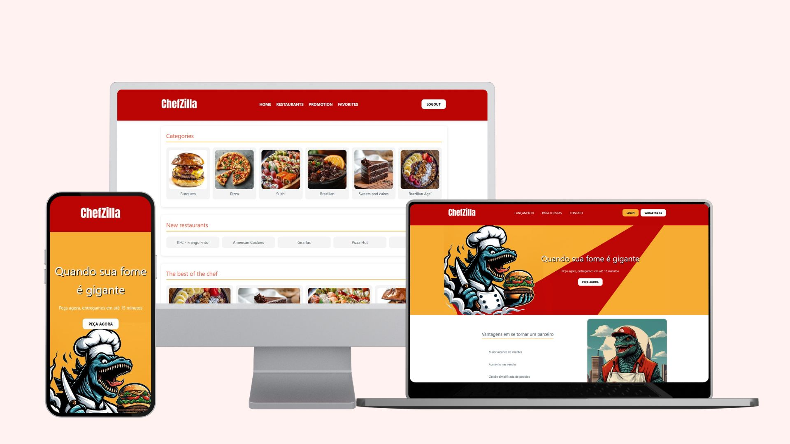
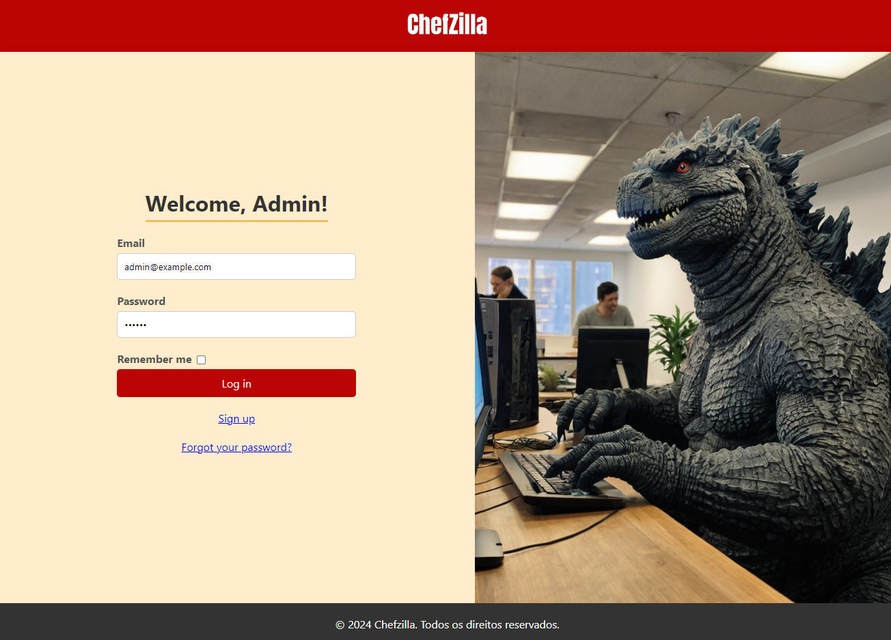
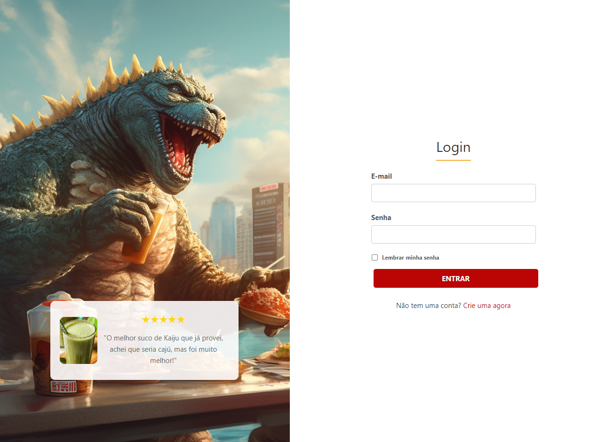
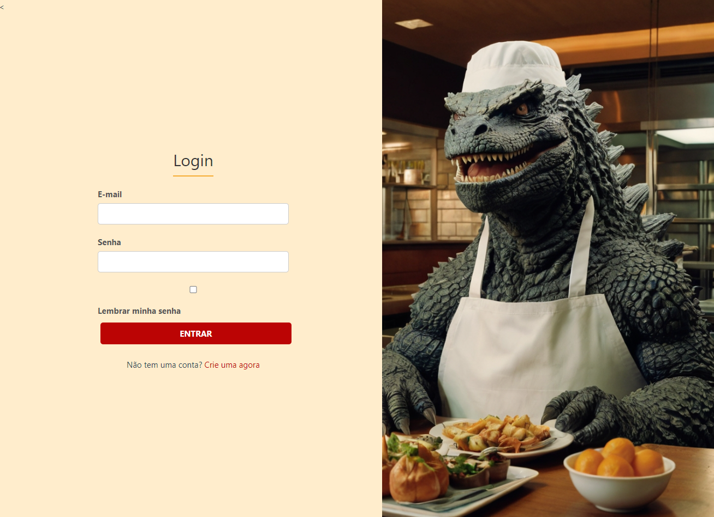
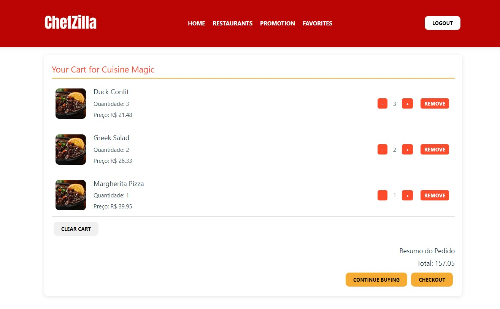
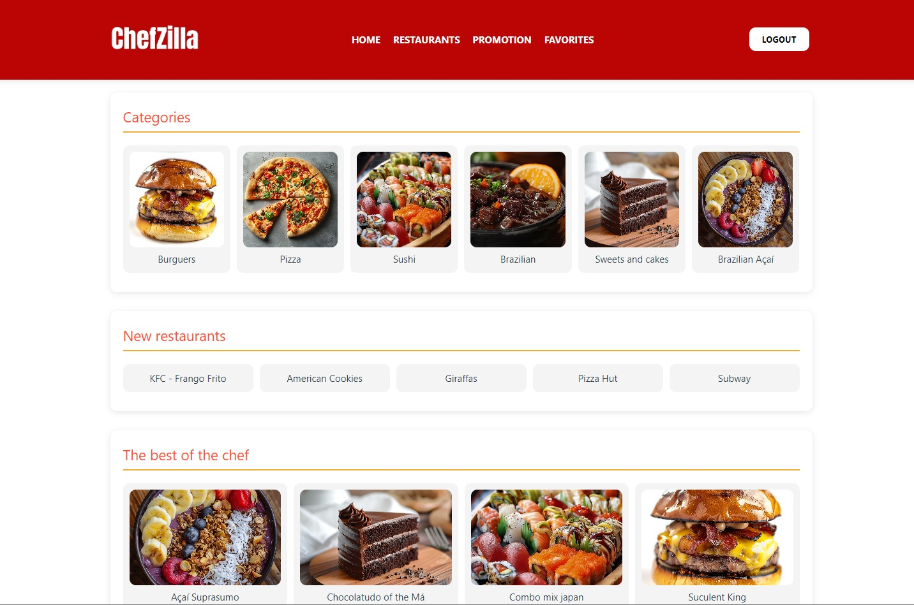

# ChefZilla - Plataforma de Delivery com Rails 7 e VUE.js


## 🌐 Desafio

Desafio final do projeto QSDV 9 da LWSA. O objetivo era criar uma plataforma de delivery de comida operacional, dividido em três aplicações: 
Usuário [ Consumy ](https://github.com/jfan-dev/consumy "Named link title") e Vendedor[ Restauranty ](https://github.com/jfan-dev/restauranty "Named link title") em VUE.js capazes de se comunicar através da API [ Delivery ](https://github.com/jfan-dev/delivery "Named link title") em Rails.
  - Consumy:
      - CRUD de novos usuários compradores,
      - listar as lojas e acessar seus produtos com paginação e ordenação,
      - realizar pedidos e o pagamento atraves da aplicação Paymenty.
        
  - Restauranty:
      - CRUD de novos usuários vendedores,
      - CRUD de lojas para o mesmo vendedor,
      - CRUD de produto,
      - E receber pedidos através da API (Delivery).
        
  - Delivery:
      - CRUD de novos usuários,
      - CRUD de lojas e atribuir vendedor a ela,
      - CRUD de novos compradores,
      - Armazenar os dados de usuários('admin,'compradores' e 'vendedores').
      - Armazenar as lojas e seus produtos.
      - Receber os pedidos dos compradores e redirecionar para a aplicação dos vendedores.
   



## 🌐 Pré-requisitos para rodar o projeto

  - Backend: Rails 7.1.3.4
  - Frontend: Vue.js

### Clonando os repositorios

```bash
> git clone https://github.com/jfan-dev/delivery.git
> git clone https://github.com/jfan-dev/consumy.git
> git clone https://github.com/jfan-dev/restauranty.git
```

### Executando o Backend

```bash
# Inicie o backend com o comando
> Rails server
```

### Executando o Frontend

```bash
# Inicie o servidor de desenvolvimento do Vue
> npm run dev
```

## 👑 Demonstração


#### ✍🏻 Features adicionais

Diferentes telas de login para facilitar ao usuário
|  Login tela admin |  Login tela cliente |  Login tela lojista |
| --- | --- | --- |

Telas internas estilizadas e responsivas
|  Tela do carrinho | Lojas |
| --- | --- |


### ✍🏻 Recursos e Tecnologias Utilizadas

| Gem                                | Uso                                                                               | Site                                      |
|------------------------------------|-----------------------------------------------------------------------------------|-------------------------------------------|
| Devise                             | Biblioteca de autenticação flexível para Rails.                                   | [Devise](https://github.com/heartcombo/devise)               |
| JWT                                | Implementação JSON Web Token em Ruby para autenticação baseada em tokens.         | [JWT](https://github.com/jwt/ruby-jwt)                                           |
| Rack-CORS                          | Middleware para suportar CORS (Cross-Origin Resource Sharing) no Rack.            | [Rack-CORS](https://github.com/cyu/rack-cors) |
| State Machines Activerecord        | Integração do state_machines com ActiveRecord para gerenciar estados dos modelos.  | [State Machines Activerecord](https://github.com/state-machines/state_machines-activerecord) |
| Kaminari                           | Biblioteca para paginação de registros no Rails.                                  | [Kaminari](https://github.com/kaminari/kaminari) |
| Faraday                            | Biblioteca HTTP flexível e modular para fazer requisições em Ruby.                | [Faraday](https://github.com/lostisland/faraday) |
| Sidekiq                            | Processamento assíncrono baseado em Redis para Ruby.                              | [Sidekiq](https://github.com/mperham/sidekiq) |
| EventMachine                       | Biblioteca de rede para Ruby que fornece eventos e I/O não-bloqueante.            | [EventMachine](https://github.com/eventmachine/eventmachine) |

## 🛠 Desafios e Soluções Enfrentados

### Overengineering 

- Por vezes me paguei super arquitetando uma solução que poderia ter sido resolvida de forma mais simples, Ex.: para implementar o carrinho de compras eu estava modelando na API Rails para a partir dela fazer a requisição do pedido. Conversando com os outros participantes do projeto percebi esse erro e criei uma abordagem 100% no front de forma a não sobrecarregar a API com o carrinho do todos os usuários.  

### API-KEY e JWT

- Tive um pouco de dificuldade para compreender o fluxo da autenticação de usuários com o uso do JWT mas novamente conversando com os participantes do projeto e lendo documentação consegui entender as variáveis de ambiente necessárias para fazer a autenticação.

## 🐼 Desenvolvido por:
Jaime Fernandes | jfernan10@gmail.com | [Linkedin](https://www.linkedin.com/in/jfan-dev)
